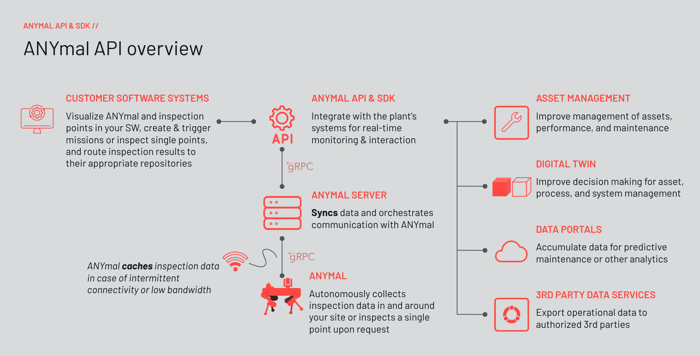

---
tags:
  - Product / ANYbotics
  - Partner
title: ANYbotics - Overview
search:
  boost: 2.0
---

# ANYmal API and SDK

## Introduction

ANYbotics offers robotic solutions for automated industrial inspections. These robotic solutions perform
routine condition monitoring tasks based on our legged robotic platforms, ANYmal and the Ex-certified
ANYmal X.

ANYmal enables operators to automate on-site inspections, increasing the safety of plant workers and
improving data quality. In addition to the ANYbotics "Workforce" user interface for robot control and mission
management, ANYbotics provides an API (Application Programming Interface) for integration with third-party
software. With the ANYmal API, you can automatically transfer inspection data, trigger robot missions, and
manage your robot fleet directly from your existing asset management or digital twin software. The ANYmal
API allows developers to harness the power of ANYmal to seamlessly integrate data into their infrastructure.

## API Capabilities

The ANYmal API integrates your automated inspection coworker, ANYmal, into your mission and data
management infrastructure. The API functionality includes:

* **Real-Time Data Streaming**: Acoustic, thermal, gas, and visual inspection feedback.
* **Mission Management**: Trigger, monitor (pause/resume/stop), and modify pre-scheduled and “click &
act” missions.
* **Detailed Feedback**: ANYmal’s pose, joint positions, and location mapping, as well as mission-critical
data for post-mission analyses.
* **Mission Notifications**: Timely updates on mission status, including completion alerts and anomaly
reporting.
* **Connectivity Management**: Stable performance during intermittent connectivity issues through
connection status monitoring and on-robot caching.
* **Battery Level Monitoring**: Track the power status to ensure uninterrupted autonomous operations.
* **Safety & Security**: Incorporate third-party authentication via OAuth, emergency and protective stop
functions, and authority management for secure access control.
* **Telepresence**: Support real-time visual feedback through WebRTC-based streaming video and
provide a direct command interface for manual navigation or task-specific commands.
These features ensure a robust platform for users to effectively deploy ANYmal for various inspection tasks
and robot operations, providing access to status, health information, and live video.

## ANYmal Server Integration

ANYmal communicates with an ANYmal server, which offers various application possibilities. The ANYmal
server allows developers to route data through the cloud infrastructure provided by ANYbotics, their own
cloud networks, or local networks as required. As a customer or partner, you can integrate ANYmal with your
own and third-party software systems for asset management, the digital twin, or the data portal, enabling
bi-directional communication.

## Development

ANYbotics sets up the data exchange via the ANYmal API with actionability and ease of use in mind: You get
time-stamped and position-referenced inspection insights and receive the information in standard file
formats such as JPG, WAV, E57, PLY, and DAE. The ANYmal API is based on an RPC (Remote Procedure Call)
API using gRPC. It is a high-performance RPC framework, using HTTP/2 for transport and Protocol Buffers for
interface description. ANYbotics also provides an SDK (Software Development Kit) to simplify interaction with
the ANYmal API in C++ and Python. You can access the code samples and comprehensive documentation for
the ANYmal SDK.
With SDK or gRPC documentation access, developers can choose how to interface with ANYmal API to control
missions, receive data, and monitor ANYmal.

## Developer Resources

ANYmal SDK code samples and complete documentation - [support team](https://support.anybotics.com/request).

The [ANYmal Research Community](https://www.anymal-research.org/) develops and shares software and other information.
